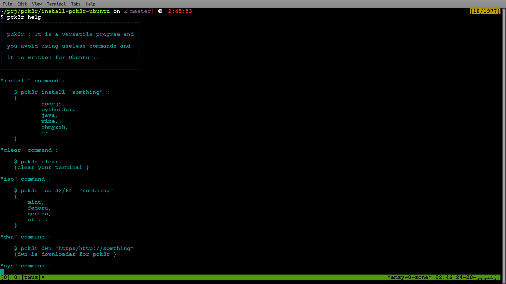

  

# pck3r



Pck3r is a modern package manager for Ubuntu. It acts as a simple tool that helps users manage software with APT, or Advanced Package Tool. Pck3r makes installing, updating, and managing software easier with a clear interface and straightforward commands.

## Logo

```
尸⼕长㇌尺
```

## System-wide Installation

To install pck3r system-wide, use the provided Makefile:

```bash
make install
```

This will copy the necessary files to `/opt/pck3r` and create a wrapper script `/usr/bin/pck3r` that runs the main executable.

To uninstall pck3r, run:

```bash
make uninstall
```

## pck3r Commands

### install

Install packages such as nodejs, wine, ohmyzsh, or others:

```bash
pck3r install "package_name"
```

Example packages:

- nodejs
- wine
- ohmyzsh
- or others

### clear

Clear your terminal (just for fun :D):

```bash
pck3r clear
```

### rm

Remove packages such as nodejs, wine, ohmyzsh, or others:

```bash
pck3r rm "package_name"
```

Example packages:

- nodejs
- wine
- ohmyzsh
- or others

### sys

Manage your operating system updates:

```bash
pck3r sys update
pck3r sys upgrade
pck3r sys updgr
```

- `update`: update your operating system
- `upgrade`: upgrade your operating system
- `updgr`: update and full-upgrade, including snap packages

### pkg

Search for packages:

```bash
pck3r pkg "package_name"
```

### version

Show the current version of pck3r:

```bash
pck3r version
```